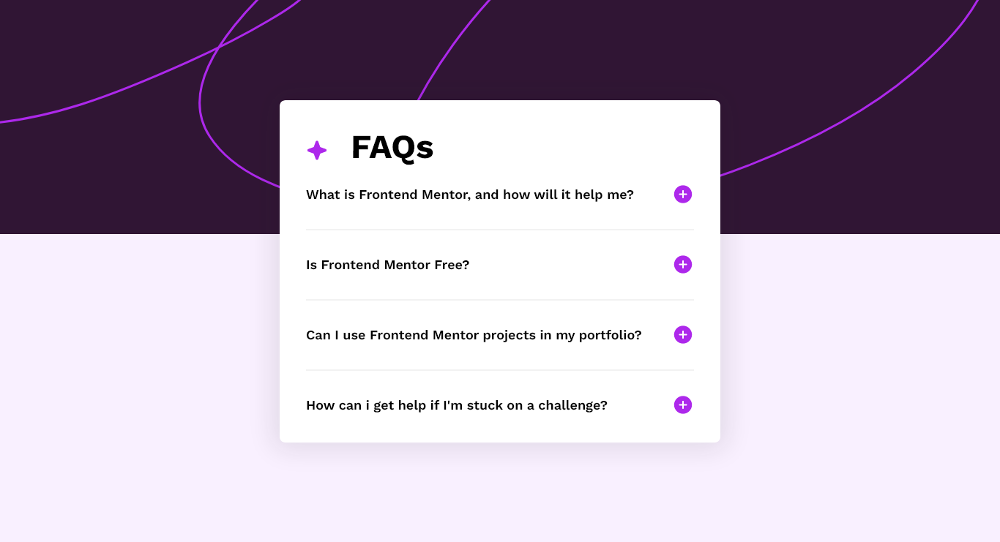

# Frontend Mentor FAQ-According
 
## Table of contents

- [Overview](#overview)
  - [The challenge](#the-challenge)
  - [Screenshot](#screenshot)
  - [Links](#links)
- [My process](#my-process)
  - [Built with](#built-with)
  - [What I learned](#what-i-learned)
- [Author](#author)

## Overview
A solution that I made from the problems that I took from the website www.frontendmentor.io is to make an FAQ-accordion. 

### The challenge

Users will be able to:

- Hide/Show the answer to a question when the question is clicked
- Navigate the questions and hide/show answers using keyboard navigation alone
- View the optimal layout for the interface depending on their device's screen size
- See hover and focus states for all interactive elements on the page

### Screenshot




### Links

- Solution URL: [Github](https://github.com/Az1sCode/FrontendMentor-FAQ-Accordion)

## My process

### Built with

- Semantic HTML5 markup
- Flexbox
- Javascript

### What I learned

Saat mengerjakan projek ini ada hal yang saya pelajari, yaitu cara membuat toggle menggunakan javascript.

```js
question.addEventListener('click', () => {
            const btnPlus = question.lastElementChild;
            btnPlus.classList.toggle('active')

            const answer = question.nextElementSibling;
            if (answer && answer.classList.contains('answer')) {
                answer.classList.toggle('active');
            }
        });
```
I create each question when clicked can eliminate/display with just one click.

## Author

- Frontend Mentor - [@Az1sCode](https://www.frontendmentor.io/profile/Az1sCode)
- Twitter - [@AbdulSiKode](https://x.com/AbdulSiKode)
